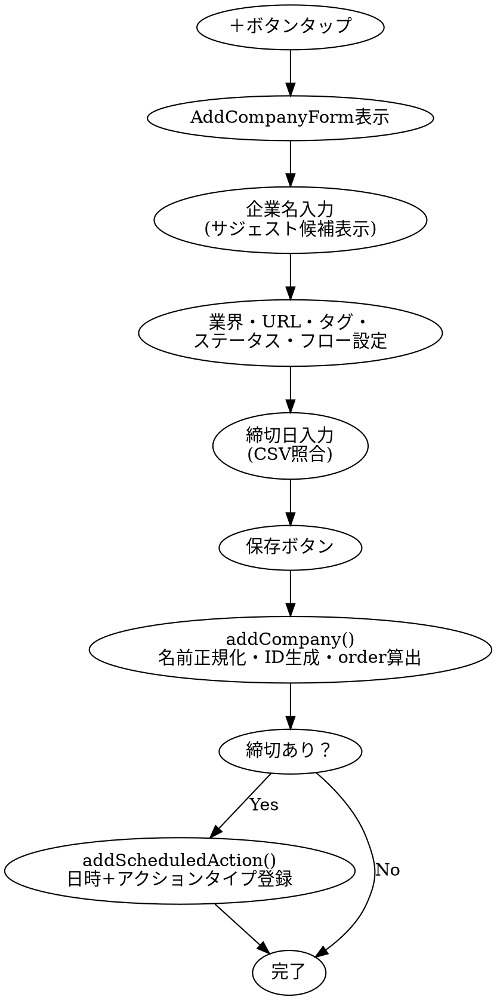
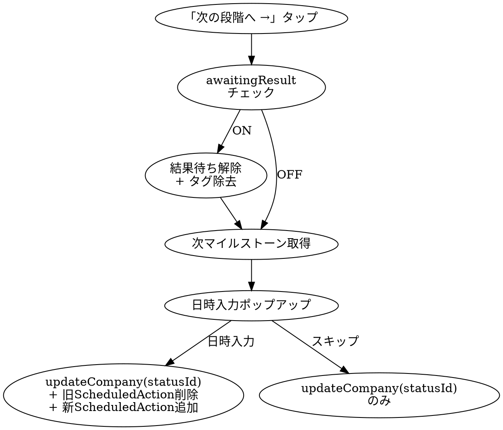

# HANDOFF-SHUKATSUBOARD-UI.md

> ShukatsuBoardのUI/UX設計・技術仕様を、新規Todoアプリ（React Native / Expo）に引き継ぐための資料

---

## 1. UI/UXパターン

### 1-1. カンバンボードの構造

| # | カラム名 | カラーコード | 用途 |
|---|---------|------------|------|
| 1 | エントリー前 | `#9CA3AF` (Gray) | 興味あり・未応募 |
| 2 | ES | `#8B5CF6` (Purple) | エントリーシート提出段階 |
| 3 | Webテスト | `#3B82F6` (Blue) | 適性検査・Webテスト段階 |
| 4 | 1次面接 | `#F97316` (Orange) | 1次面接 |
| 5 | 2次面接 | `#F97316` (Orange) | 2次面接 |
| 6 | 3次面接 | `#F97316` (Orange) | 3次面接 |
| 7 | 最終面接 | `#F97316` (Orange) | 最終面接 |
| 8 | 内定 | `#22C55E` (Green) | 内定取得 |
| 9 | 見送り | `#6B7280` (Gray) | 辞退・不合格（アーカイブ扱い） |

**カードの動き:**
- カードは1つのカラム（`statusId`）に属する
- 「次の段階へ →」ボタンで次のマイルストーンへ進む
- ステータス変更時に日時入力ポップアップが表示される（スキップも可能）
- `sortField='manual'` 時のみ @dnd-kit によるドラッグ&ドロップ並び替えが有効
- カラムの表示/非表示・並び順は設定画面から変更可能

### 1-2. カードのデザイン仕様（TaskCard）

```
┌─────────────────────────────────────────────┐
│▌ [ドラッグハンドル] 企業名  [ES] [結果待ち] [次の段階へ →] │  ← Row 1
│▌                    (業界名)                              │
│▌ ● ● ● ○ ○ ○ ○                                          │  ← Row 2: 進捗ドット
│▌ [優遇あり] [早期選考]                                     │  ← Row 3: タグ
│▌ 📅 3/20(木) ES締切  |  🎤 3/25(火) 14:00 1次面接         │  ← Row 4: 次のアクション
└─────────────────────────────────────────────┘
```

**表示項目:**
- 左端カラーストリップ（6px幅）: ステージカラー。タップで「結果待ち」トグル
- 企業名: `text-[15px] font-semibold`
- 業界名: `text-[13px]`（displaySettings.showIndustry で表示切替）
- ステータスバッジ: ステージカラーの角丸ピル
- 結果待ちバッジ: amber色（`awaitingResult` フラグ連動）
- 進捗ドット: 7ドット、現在ステージにアニメーション（ping）
- タグ: 色分けされたピル型バッジ
- 次のアクション日時: 期限超過で赤色表示

**タップ時の挙動:**
- カード全体タップ → CompanyDetailModal を開く
- 左カラーストリップタップ → 結果待ちトグル
- 「次の段階へ →」ボタン → ステージ進行フロー
- タップフィードバック: `active:scale-[0.98]`

### 1-3. モーダル（CompanyDetailModal）の構造

**ヘッダー（固定）:**
- グラブバー（モバイル用）
- 編集可能な企業名入力欄
- 閉じるボタン（⊕アイコン）
- ステータスセレクター（青色ピル + ▾）
- 「次の段階へ」ボタン
- 直近の予定バッジ / CSV締切バッジ

**タブナビゲーション（4タブ、アンダーラインインジケーター）:**

| タブ | 内容 |
|------|------|
| 選考詳細 | タグのトグル選択 |
| 基本情報 | 業界ドロップダウン、職種、URL、カスタム選考フロー編集 |
| マイページ | マイページURL、ログインID、パスワード（表示/非表示トグル） |
| メモ | ES、面接メモ、逆質問、その他（4つのテキストエリア） |

**フッター（固定）:**
- 保存ボタン（プライマリブルー）
- 削除ボタン（赤テキスト）→ 確認ダイアログ → 削除実行

**スタイリング:**
- モバイル: `rounded-t-2xl`（下からスライドアップ）
- デスクトップ: `rounded-2xl`（中央配置）
- Framer Motion: `y: 24 → 0`, duration 0.35s
- 最大幅: `max-w-lg`

### 1-4. カラーパレット

#### ライトモード（デフォルト）
| 用途 | CSS変数 | 値 |
|------|--------|-----|
| プライマリ | `--color-primary` | `#007AFF` |
| プライマリ背景 | `--color-primary-light` | `#E8F0FE` |
| ページ背景 | `--color-bg` | `#F2F2F7` |
| カード背景 | `--color-card` | `#FFFFFF` |
| テキスト | `--color-text` | `#1C1C1E` |
| セカンダリテキスト | `--color-text-secondary` | `#8E8E93` |
| ボーダー | `--color-border` | `#E5E5EA` |
| 危険 | `--color-danger` | `#FF3B30` |
| 成功 | `--color-success` | `#34C759` |
| 警告 | `--color-warning` | `#FF9500` |

#### ダークモード
| 用途 | CSS変数 | 値 |
|------|--------|-----|
| プライマリ | `--color-primary` | `#0A84FF` |
| プライマリ背景 | `--color-primary-light` | `#1a2744` |
| ページ背景 | `--color-bg` | `#09090b` |
| カード背景 | `--color-card` | `#18181b` |
| テキスト | `--color-text` | `#f4f4f5` |
| セカンダリテキスト | `--color-text-secondary` | `#71717a` |
| ボーダー | `--color-border` | `#27272a` |
| 危険 | `--color-danger` | `#FF453A` |
| 成功 | `--color-success` | `#30D158` |
| 警告 | `--color-warning` | `#FF9F0A` |

#### タグカラー
| タグ名 | 背景 | テキスト |
|--------|------|---------|
| 優遇あり | `bg-red-500/10` | `text-red-500` |
| 早期選考 | `bg-blue-500/10` | `text-blue-500` |
| リクルーター面談 | `bg-purple-500/10` | `text-purple-500` |
| 結果待ち | `bg-amber-500/10` | `text-amber-500` |
| インターン参加済み | `bg-green-500/10` | `text-green-500` |

### 1-5. デザイントークン

#### フォント
- ファミリー: `-apple-system, BlinkMacSystemFont, "Segoe UI", system-ui, sans-serif`
- スムージング: `antialiased`

#### フォントサイズ
| 要素 | サイズ | ウェイト |
|------|-------|---------|
| ページタイトル | `text-lg` (18px) | `font-bold` |
| 企業名 | `text-[15px]` | `font-semibold` |
| モーダルタイトル | `text-[20px]` | `font-bold` |
| タブラベル | `text-[12px]` | `font-semibold` |
| フォームラベル | `text-[13px]` | `font-semibold`, uppercase, tracking-wide |
| セクションヘッダー | `text-[13px]` | `font-bold`, uppercase, tracking-wider |
| バッジテキスト | `text-[11px]` | `font-bold` |
| タグテキスト | `text-[11px]`〜`text-[13px]` | `font-semibold`〜`font-bold` |
| セカンダリテキスト | `text-[13px]` | normal |
| ボトムナビラベル | `text-[10px]` | `font-medium` / `font-semibold` |

#### 角丸（border-radius）
| 要素 | 値 |
|------|-----|
| カード・モーダル | `rounded-2xl` (16px) |
| ボタン・バッジ | `rounded-xl` (12px) |
| 入力フィールド | `rounded-xl` (14px) |
| ピル型バッジ | `rounded-full` |

#### 余白・スペーシング
| パターン | 値 |
|----------|-----|
| カード間 | `space-y-2` (8px) |
| セクション内パディング | `px-4 pt-4` |
| モーダル内パディング | `p-4`〜`p-6` |
| ヘッダー高さ | 56px (`h-14`) |
| ボトムナビ高さ | 64px (`h-16`) + safe-area |

#### シャドウ・エレベーション
| 要素 | 値 |
|------|-----|
| カード | `shadow-sm` + `border border-[var(--color-border)]` |
| モーダルオーバーレイ | `bg-black/50` |

### 1-6. ダークモード対応

**実装方法:** CSS custom properties + `.dark` クラスセレクター

```css
:root {
  --color-primary: #007AFF;
  --color-bg: #F2F2F7;
  /* ... */
}
.dark {
  --color-primary: #0A84FF;
  --color-bg: #09090b;
  /* ... */
}
```

**テーマ切替:**
- Light / Dark / System の3モード
- `localStorage` に `"theme"` キーで保存
- `window.matchMedia('(prefers-color-scheme: dark)')` でシステム設定を検出
- `<html>` 要素の class に `.dark` を付与/除去

**React Native移植時の注意:**
- CSS変数は使えないため、テーマオブジェクト（`colors.light` / `colors.dark`）に変換が必要
- `useColorScheme()` + Context で切り替え
- `react-native-paper` や `@react-navigation/native` のテーマ機能と統合推奨

---

## 2. コンポーネント設計

### 2-1. 主要コンポーネント一覧

#### レイアウト (`src/components/layout/`)
| コンポーネント | 役割 |
|--------------|------|
| Header.tsx | 固定トップバー（56px）。ページタイトル、テーマトグル、設定ボタン |
| BottomNav.tsx | 固定ボトムナビ（64px）。4タブ: ホーム/企業/カレンダー/締切 |
| ThemeProvider.tsx | Light/Dark/Systemテーマ管理。Context経由で提供 |
| PageTransition.tsx | Framer Motionページ遷移ラッパー |
| ToastDisplay.tsx | トースト通知表示レイヤー |
| NotificationScheduler.tsx | Capacitorローカル通知スケジュール |

#### ボード/企業 (`src/components/board/`)
| コンポーネント | 役割 |
|--------------|------|
| TaskCard.tsx | 企業カード。カラーストリップ、進捗ドット、タグ、次アクション表示 |
| CompanyDetailModal.tsx | 企業詳細モーダル（4タブ）。編集・ステータス変更・削除 |
| AddCompanyForm.tsx | 企業追加フォーム。名前候補サジェスト、締切CSV照合、フロー編集 |
| BulkImportModal.tsx | CSV/テキスト一括インポート |
| SelectionFlowEditor.tsx | カスタム選考フロー編集。プリセット + カスタム入力 |
| ErrorBoundary.tsx | モーダル内レンダーエラーキャッチ |

#### カレンダー (`src/components/calendar/`)
| コンポーネント | 役割 |
|--------------|------|
| MonthCalendar.tsx | 月表示グリッド |
| UpcomingList.tsx | 直近予定の縦型リスト |
| FilterChips.tsx | アクションタイプ別フィルターチップ |

#### オンボーディング・設定
| コンポーネント | 役割 |
|--------------|------|
| GradYearSelectModal.tsx | 初回起動時の卒業年度選択 |
| TutorialModal.tsx | ページ別チュートリアル（ステップ制御） |
| SettingsModal.tsx | 4タブ設定: ステータス管理/表示設定/通知/データ |

### 2-2. Zustandストア設計 (`useAppStore`)

#### 状態構造

```typescript
interface AppState {
  // === データ ===
  companies: Company[];           // 企業リスト
  statusColumns: StatusColumn[];  // カンバンカラム定義
  interviews: Interview[];        // 面接記録（現在未使用領域あり）
  scheduledActions: ScheduledAction[]; // 予定アクション（ホーム・カレンダーの元データ）

  // === 設定 ===
  displaySettings: DisplaySettings;        // 表示トグル6種
  notificationSettings: NotificationSettings; // 通知設定
  gradYear: GradYear | null;               // 卒業年度
  tutorialFlags: TutorialFlags;            // チュートリアル表示済みフラグ

  // === schemaVersion ===
  schemaVersion: 14;  // マイグレーション管理用
}
```

#### DisplaySettings
```typescript
interface DisplaySettings {
  showTag: boolean;            // タグバッジ表示
  showIndustry: boolean;       // 業界名表示
  showNextInterview: boolean;  // 次の面接情報表示
  showUpdatedDate: boolean;    // 更新日時表示
  showDeadlineBadge: boolean;  // 締切バッジ表示
  showProgressBar: boolean;    // 進捗ドット表示
}
// すべてデフォルト true
```

#### 主要アクション
| アクション | 引数 | 動作 |
|-----------|------|------|
| `addCompany` | Company部分オブジェクト | nanoid生成、名前正規化（株式会社除去）、orderInColumn算出 |
| `updateCompany` | id, updates | 名前正規化、updatedAt更新 |
| `deleteCompany` | id | カスケード削除（interviews + scheduledActions） |
| `moveCompany` | companyId, newStatusId, newOrder | 旧/新カラムのorder再計算 |
| `addScheduledAction` | action | ID生成、company.nextAction*フィールド自動更新 |
| `deleteScheduledAction` | id | 次の未来アクションでcompany.nextAction*を再計算 |
| `toggleAwaitingResult` | companyId | awaitingResultフラグ反転 |
| `addStatus` / `updateStatus` / `deleteStatus` | 各種 | カラムCRUD（企業存在時は削除拒否） |
| `reorderStatuses` | orderedIds[] | カラム並び順更新 |
| `updateDisplaySetting` | key, value | 表示設定の個別トグル |
| `loadBackup` | data | 状態全体のリストア（v14互換） |

#### Persist設定
```typescript
persist(stateCreator, {
  name: 'shukatsu-board-data',  // localStorageキー
  version: 14,                   // CURRENT_SCHEMA_VERSION
  migrate: (persistedState, version) => { /* v1→v14 段階的マイグレーション */ }
})
```

### 2-3. 再利用可能コンポーネントの仕様

**TaskCard（カード）:**
- Props: `company`, `statusName`, `onOpenDetail`, `sortField`, `displaySettings`
- 内部状態: なし（完全にprops駆動）
- dnd-kit `useSortable` で並び替え対応

**CompanyDetailModal（モーダル）:**
- Props: `company`, `isOpen`, `onClose`
- 内部状態: 各フィールドの編集値、アクティブタブ、確認ダイアログ表示
- 保存時にストアへ一括反映

**SelectionFlowEditor（選考フロー編集）:**
- Props: `value` (string[]), `onChange`
- プリセットボタン + カスタム入力の2段構成
- DEFAULT_FLOW_STAGES: 内定・見送り以外の全デフォルトステータス

---

## 3. 操作フロー

### 3-1. カード作成フロー



### 3-2. カード編集フロー

1. TaskCard タップ → CompanyDetailModal 表示
2. 各タブでフィールド編集（ローカルstate）
3. 「保存」ボタン → `updateCompany()` で一括反映
4. ステータス変更検知 → トースト通知表示
5. 内定ステータスへの変更 → `fireConfetti()` 紙吹雪アニメーション

### 3-3. カード削除フロー

1. CompanyDetailModal フッター → 「削除」ボタン
2. 確認ダイアログ（企業名表示）
3. `deleteCompany(id)` → interviews + scheduledActions もカスケード削除

### 3-4. ステータス変更フロー（次の段階へ）



**特殊ケース:** インターン選考中 → 本選考への昇格モーダルが表示される

### 3-5. ドラッグ&ドロップの実装方針

- **ライブラリ:** `@dnd-kit/core` v6 + `@dnd-kit/sortable`
- **有効条件:** `sortField === 'manual'` の場合のみ
- **センサー:** `PointerSensor` with `activationConstraint: { distance: 8 }` （8px移動で発動、誤タップ防止）
- **ドラッグ中:** `opacity: 0.5`、CSS transform適用
- **ドロップ時:** `handleDragEnd` → `reorderCompanies()` で order 再計算

**React Native移植時:** `react-native-reanimated` + `react-native-gesture-handler` に置換。`@dnd-kit` はWeb専用。

### 3-6. タブ切り替えの仕組み

- **ボトムナビ:** Next.js App Router のパス遷移（`/`, `/tasks`, `/calendar`, `/deadline`）
- **モーダル内タブ:** useState による `activeTab` 切り替え（0〜3）、アンダーラインインジケーター付き
- **React Native移植時:** `@react-navigation/bottom-tabs` + `@react-navigation/material-top-tabs` に置換

---

## 4. 技術的な注意点

### 4-1. React 19での無限ループ回避パターン（Zustandセレクター）

```tsx
// ❌ NG: オブジェクトセレクターはレンダー毎に新参照 → 無限ループ
const displaySettings = useAppStore((s) => s.displaySettings);

// ✅ OK: useShallow で浅い比較
import { useShallow } from 'zustand/react/shallow';
const displaySettings = useAppStore(useShallow((s) => s.displaySettings));

// ✅ OK: 個別フィールドなら直接セレクト
const showTag = useAppStore((s) => s.displaySettings.showTag);

// ✅ OK: レンダー外で最新状態が必要な場合
const freshState = useAppStore.getState();
```

**React Native移植時:** 同じパターンがそのまま適用可能。Zustand は React Native でも動作する。

### 4-2. date-fns の使い方と注意点

```tsx
import { format, parseISO, isValid, addDays } from 'date-fns';
import { ja } from 'date-fns/locale';
```

**保存形式:**
| フィールド | 形式 | 例 |
|-----------|------|-----|
| Company.nextActionDate | `"YYYY-MM-DD"` | `"2026-03-20"` |
| ScheduledAction.date | `"YYYY-MM-DD"` | `"2026-03-20"` |
| ScheduledAction.startTime | `"HH:mm"` | `"14:00"` |
| ScheduledAction.endTime | `"HH:mm"` | `"15:30"` |

**注意点:**
1. `parseISO()` はUTCとして解釈する。ローカル日付文字列を渡すとタイムゾーンずれの原因になる
2. **必ず `isValid()` でバリデーション**してからフォーマットする
3. `format(date, 'M/d(E)', { locale: ja })` → `"3/15(土)"` （ゼロパディングなし）
4. 日付比較は文字列比較でOK: `c.nextActionDate <= today` （ISO形式なので辞書順=日付順）

### 4-3. schemaVersion の管理方法

- 現在のバージョン: **14**
- `persist` の `version` パラメータと `migrate` 関数で管理
- ロード時に保存バージョン < 現行バージョンなら段階的にマイグレーション実行
- 主なマイグレーション履歴:
  - v4→v5: `priority` → `tags[]` に変換
  - v9→v10: ステータスカラム名リマップ、`awaitingResult` 追加
  - v12→v13: 企業名から「株式会社」「有限会社」を除去
  - v13→v14: `ScheduledAction.time` → `startTime` にリネーム

**新アプリへの推奨:** 初期バージョンから schemaVersion を導入し、マイグレーション関数を段階的に積み上げる設計にすること。

### 4-4. TaskCard のスタイリング上の制約

- 左カラーストリップ（6px）はボタン要素で、タップ領域が狭い → モバイルでは hit area 拡大が必要
- `active:scale-[0.98]` のタップフィードバックは CSS transform で実装 → React Native では `Pressable` + `Animated` に置換
- 進捗ドット（7個）は固定数ではなく `getMilestones()` の結果に依存 → カスタムフローで増減する
- `awaitingResult` 時のカラーストリップ opacity 変更（`0.4`）は視認性がやや低い → 改善余地あり

---

## 5. 今後の新アプリへの推奨事項

### 5-1. ShukatsuBoardで「やっておけばよかった」設計判断

| 課題 | 現状 | 推奨 |
|------|------|------|
| **データ保存** | localStorage のみ（端末紛失で全消失） | 初期からクラウド同期を設計に含める（Supabase, Firebase等） |
| **スキーマ進化** | 14回のマイグレーション積み上げで複雑化 | 最初から柔軟なスキーマ設計 + マイグレーションテストを書く |
| **結果待ちの二重管理** | `awaitingResult` フラグ + `'結果待ち'` タグが両方存在 | 単一のソースオブトゥルースに統一する |
| **企業名正規化** | マイグレーションで後追い対応 | 入力時に正規化ルールを適用 + 表示用と検索用を分離 |
| **テスト不足** | ユニットテスト・E2Eテストなし | 最初からテスト基盤を構築（Jest + React Native Testing Library） |
| **型の肥大化** | Company型にフィールドが増え続けた | 関連データは別テーブル/ストアに分離（正規化） |
| **カスタムフロー** | 後から追加、既存ロジックとの整合性確保が大変 | 最初からカスタマイズ可能な設計にする |
| **アニメーション** | Framer Motion依存でパフォーマンス問題あり | React Native Reanimated を最初から使う |
| **表示設定の増殖** | 6個のトグルが個別管理 | プリセット（コンパクト/標準/詳細）+ 個別カスタムの2層構造 |

### 5-2. React Native（Expo）移植時の注意点・変換ポイント

#### ナビゲーション
| Web (Next.js) | React Native (Expo) |
|----------------|---------------------|
| App Router パス遷移 | `expo-router` or `@react-navigation` |
| BottomNav.tsx (自前) | `@react-navigation/bottom-tabs` |
| モーダル内タブ (useState) | `@react-navigation/material-top-tabs` |
| URL パラメータ | `useLocalSearchParams()` |

#### スタイリング
| Web (Tailwind CSS) | React Native |
|--------------------|--------------|
| `className="..."` | `StyleSheet.create({})` or NativeWind |
| CSS変数 (`--color-*`) | テーマオブジェクト + Context |
| `backdrop-blur-xl` | `expo-blur` の `BlurView` |
| `rounded-2xl` (16px) | `borderRadius: 16` |
| `shadow-sm` | `shadowOffset`, `shadowOpacity`, `elevation` |
| `animate-ping` | `react-native-reanimated` |

#### ドラッグ&ドロップ
| Web (@dnd-kit) | React Native |
|----------------|-------------|
| `useSortable` | `react-native-reanimated` + `react-native-gesture-handler` |
| PointerSensor | `PanGestureHandler` / `LongPressGestureHandler` |
| CSS transform | `useAnimatedStyle` + `useSharedValue` |

#### データ永続化
| Web (localStorage) | React Native |
|--------------------|-------------|
| `localStorage.setItem` | `@react-native-async-storage/async-storage` |
| Zustand persist (localStorage) | Zustand persist (AsyncStorage adapter) |
| 同期API | **非同期API** → `createJSONStorage(() => AsyncStorage)` |

#### その他の変換ポイント
- **フォント:** `system-ui` → React Native はプラットフォームデフォルト。カスタムフォントは `expo-font` で読み込み
- **Safe Area:** `env(safe-area-inset-bottom)` → `react-native-safe-area-context` の `SafeAreaView`
- **スクロール:** `overflow-y-auto` → `ScrollView` / `FlatList`
- **タッチフィードバック:** `active:scale-[0.98]` → `Pressable` + `Animated.Value` or `react-native-reanimated`
- **紙吹雪:** canvas-based → `react-native-confetti-cannon` 等のネイティブライブラリ
- **トースト:** 自前実装 → `react-native-toast-message` 推奨
- **CSV処理:** ブラウザ fetch → `expo-file-system` でバンドル読み込み、またはAPIから取得
- **通知:** `@capacitor/local-notifications` → `expo-notifications`
- **入力フォーカス:** CSS `box-shadow` → React Native `borderColor` 変更 + `KeyboardAvoidingView`

#### パフォーマンス推奨
- カード一覧は `FlatList` + `keyExtractor` + `getItemLayout`（固定高の場合）で仮想化
- 重いリストでは `React.memo` + `useCallback` を徹底
- Zustandセレクターは個別フィールド単位で切る（`useShallow` 多用は避ける）
- 画像・アイコンは `expo-image` でキャッシュ管理

---

## 付録: 型定義リファレンス

```typescript
type ActionType = 'es' | 'webtest' | 'gd' | 'interview' | 'other';
type SelectionType = 'intern' | 'main';
type Tag = '優遇あり' | '早期選考' | 'リクルーター面談' | '結果待ち' | 'インターン参加済み';

interface Company {
  id: string;
  name: string;
  statusId: string;
  selectionType: SelectionType;
  industry?: string;
  jobType?: string;
  url?: string;
  myPageUrl?: string;
  myPageLoginId?: string;
  myPagePassword?: string;
  tags: Tag[];
  memo: { es: string; interview: string; reverseQuestion: string; other: string };
  awaitingResult: boolean;
  orderInColumn: number;
  nextActionDate?: string;      // "YYYY-MM-DD"
  nextActionType?: ActionType;
  nextActionTime?: string;      // "HH:mm"
  nextActionDeadline?: string;
  customMilestones?: string[];
  createdAt: string;            // ISO datetime
  updatedAt: string;            // ISO datetime
}

interface StatusColumn {
  id: string;
  name: string;
  order: number;
  isHidden?: boolean;
}

interface ScheduledAction {
  id: string;
  companyId: string;
  type: ActionType;
  subType?: string;             // e.g., '最終面接'
  date: string;                 // "YYYY-MM-DD"
  startTime?: string;           // "HH:mm"
  endTime?: string;             // "HH:mm"
  note?: string;
}

interface Interview {
  id: string;
  companyId: string;
  datetime: string;             // ISO datetime with time
  type: string;
  notes?: string;
}
```
